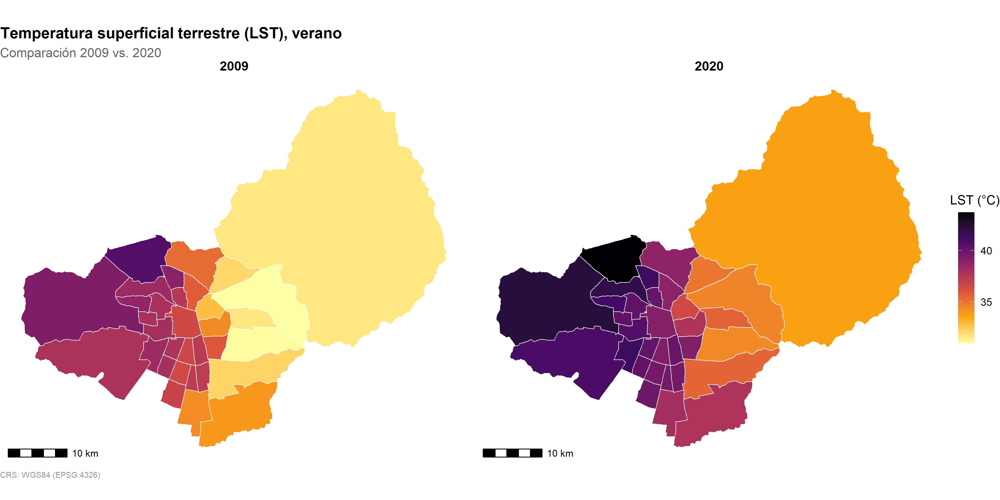
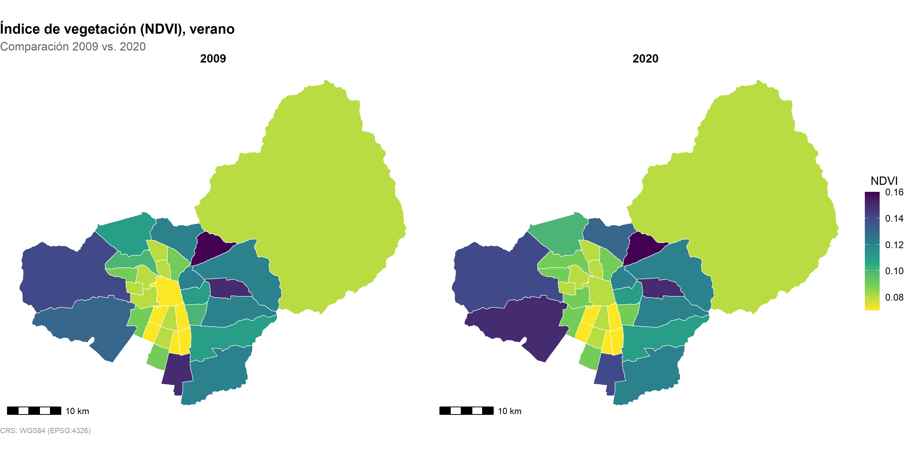

# Built Environment and Preterm Birth in Santiago, Chile (2009–2020)


**Fondecyt Nº 11240322**: Climate change and urban health: how air pollution, temperature, and city structure relate to preterm birth.

## 👥 Research Team

📬 **Estela Blanco** (estela.blanco@uc.cl) - **Principal Investigator**

📬 **Isidora Vidal** (isidora.vidal@ug.uchile.cl) - **Research Assistant / Geographer**

**Research Collaborators**: José Daniel Conejeros, Ismael Bravo

---

## 🌆 What is the Built Environment?

The **built environment** refers to the human-made physical surroundings in which we live, work, and move: buildings, streets, parks, industrial zones, transportation networks, together with the natural elements embedded within cities, such as vegetation, water bodies, and topography.

It is typically described through a set of interrelated components:

- **Green infrastructure**: parks, tree canopy, vegetation cover
- **Grey infrastructure**: impervious surfaces, buildings, roads
- **Urban form**: population density, land use, connectivity
- **Thermal environment**: surface temperature, heat retention
- **Socioeconomic fabric**: vulnerability, access to services, industrial activity

These components do not act in isolation. Together, they shape the everyday conditions in which people live and increasingly, research shows that **where we live has direct consequences for our health**, independent of individual behavior or genetics. Exposure to heat, pollution, or lack of green space during pregnancy, in particular, has been linked to adverse birth outcomes such as preterm birth.

This repository focuses on characterizing the built environment of the **33 urban municipalities of the Santiago Metropolitan Region**, Chile, identifying the variables that describe how each comuna is built, greened, and structured as a first step toward understanding whether these characteristics modify the relationship between extreme heat and preterm birth.

As an example, the maps below illustrate two dimensions of the built environment captured in this project: surface temperature, capturing the thermal environment shaped by urbanization and vegetation cover, a key indicator of green infrastructure.

**Surface Temperature Change (summer), 2009–2020**


**Vegetation Cover Change (NDVI), 2009–2020**



---

## 🎯 Project Overview

This section corresponds to **Objective 3** of Fondecyt N°11240322: to investigate how built environment characteristics (green space, heat, pollution, social vulnerability) modify the association between extreme heat and preterm birth, across the 33 urban municipalities of the Santiago Metropolitan Region, 2009–2020.

### Current Status

- ✅ Built environment database (Product 1) — complete, 33 municipalities × 2009–2020
- ✅ Consolidated analytical dataset (Product 2) — merges built environment + births
- 🔄 Descriptive maps and tables (Product 3) — in progress
- 🔄 Statistical analysis of effect modification — **in process**
- ⬜ Full reproducible repository (Product 4) — upcoming

---

## 📁 Repository Structure

```
PTB_Built_environment/
├── 01_Input/          # Datos de ambiente construido y base analítica
├── 02_Code/            # Scripts de procesamiento y análisis
├── 03_Output/          # Mapas, tablas y figuras
└── README.md
```
## ✉️ Contact

For questions about the code or methodology in this section: Isidora Vidal (isidora.vidal@ug.uchile.cl).

---
---

# Ambiente Construido y Parto Prematuro en Santiago, Chile (2009–2020)


**Fondecyt Nº 11240322**: Cambio climático y salud urbana: cómo la contaminación del aire, la temperatura y la estructura de la ciudad se relacionan con el parto prematuro.

## 👥 Equipo de Investigación

📬 **Estela Blanco** (estela.blanco@uc.cl) - **Investigadora Principal**

📬 **Isidora Vidal** (isidora.vidal@ug.uchile.cl) - **Asistente de Investigación / Geógrafa**

**Colaboradores de Investigación**: José Daniel Conejeros, Ismael Bravo

---

## 🌆 ¿Qué es el Ambiente Construido?

El **ambiente construido** se refiere al entorno físico creado por el ser humano en el que vivimos, trabajamos y nos movemos: edificios, calles, parques, zonas industriales, redes de transporte, junto con los elementos naturales presentes en la ciudad, como la vegetación, cuerpos de agua y la topografía.

Habitualmente se describe a través de un conjunto de componentes interrelacionados:

- **Infraestructura verde**: parques, cobertura arbórea, vegetación
- **Infraestructura gris**: superficies impermeables, edificaciones, vías
- **Forma urbana**: densidad poblacional, uso de suelo, conectividad
- **Ambiente térmico**: temperatura superficial, retención de calor
- **Tejido socioeconómico**: vulnerabilidad, acceso a servicios, actividad industrial

Estos componentes no actúan de forma aislada. En conjunto, dan forma a las condiciones cotidianas en las que vive la población y cada vez más evidencia muestra que **el lugar donde habitamos tiene consecuencias directas sobre nuestra salud**, independientemente del comportamiento individual o la genética. La exposición a calor, contaminación o falta de áreas verdes durante el embarazo, en particular, se ha asociado a resultados adversos del nacimiento como el parto prematuro.

Este repositorio se enfoca en caracterizar el ambiente construido de las **33 comunas urbanas de la Región Metropolitana de Santiago**, Chile, identificando las variables que describen cómo está construida, cuánto verde tiene y cómo se estructura cada comuna como primer paso para entender si estas características modifican la relación entre el calor extremo y el parto prematuro.

A modo de ejemplo, los mapas a continuación ilustran dos dimensiones del ambiente construido capturadas en este proyecto: la temperatura superficial, que demuestra el ambiente térmico moldeado por la urbanización y la cobertura de vegetación, un indicador de infraestructura verde.

**Cambio en Temperatura Superficial (verano), 2009–2020**


**Cambio en Cobertura de Vegetación (NDVI), 2009–2020**

---

## 🎯 Descripción del Proyecto

Esta sección corresponde al **Objetivo 3** del FONDECYT N°11240322: investigar cómo las características del ambiente construido (áreas verdes, calor, contaminación, vulnerabilidad social) modifican la asociación entre calor extremo y parto prematuro, en las 33 comunas urbanas de la Región Metropolitana de Santiago, período 2009-2020.

### Estado Actual

- ✅ Base de datos de ambiente construido (Producto 1) — completa, 33 comunas × 2009-2020
- ✅ Base analítica consolidada (Producto 2) — integra ambiente construido + nacimientos
- 🔄 Mapas y tablas descriptivas (Producto 3) — en curso
- 🔄 Análisis estadístico de modificación de efecto — **en proceso**
- ⬜ Repositorio reproducible completo (Producto 4) — próximamente

---

## 📁 Estructura del Repositorio

```
PTB_Built_environment/
├── 01_Input/ # Datos de ambiente construido y base analítica
├── 02_Code/ # Scripts de procesamiento y análisis
├── 03_Output/ # Mapas, tablas y figuras
└── README.md
```
